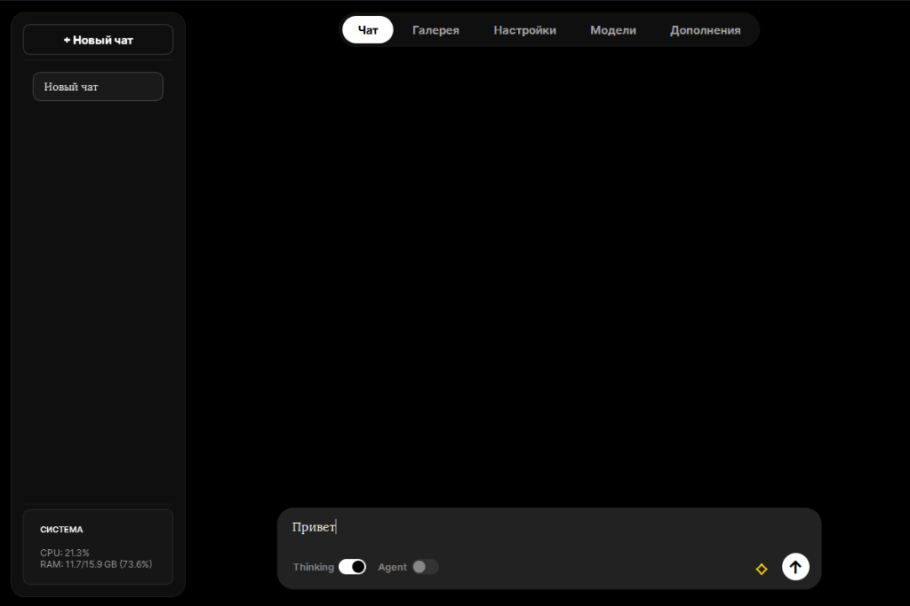
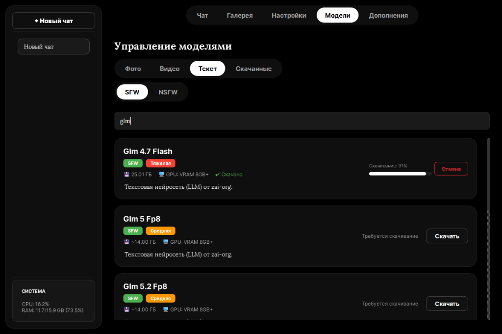

# OmniStudio

A high-performance, cross-platform desktop application for local AI image, video, and text generation. Built on top of PyTorch and Hugging Face Diffusers, OmniStudio provides a secure, fully offline environment for neural network inference with a sleek, hardware-accelerated UI powered by PyQt6.

<p align="center">
  
  
</p>

## Architecture and Killer Features

OmniStudio is engineered to bridge the gap between complex machine learning pipelines and consumer-grade desktop hardware. 

- **Zero-Cloud Local Inference**: 100% offline execution. No telemetry, no API rate limits, and total data privacy.
- **Dynamic VRAM Management**: Implements aggressive memory optimization techniques to run massive models (e.g., FLUX.1, SDXL) on mid-range GPUs (>= 8GB VRAM).
  - Includes CPU Offloading (`enable_model_cpu_offload`), VAE slicing, and attention slicing.
  - Native support for 8-bit and 4-bit model quantization via `bitsandbytes`.
  - Dynamic `torch.bfloat16` and `torch.float16` precision mapping based on host capabilities.
- **Multi-Modal Generation Pipelines**:
  - **Image Synthesis**: Support for standard Stable Diffusion, SDXL, and FLUX architectures with hot-swappable schedulers (Euler a, DPM++ 2M Karras, DDIM, etc.).
  - **Video Generation**: Integrated Stable Video Diffusion (SVD) and I2VGen-XL. Utilizes iterative chunk decoding (`decode_chunk_size=8`) to prevent Out-Of-Memory exceptions during high-fidelity MP4 compilation.
  - **Inpainting Workspace**: A custom `QGraphicsScene`-based mask editor allowing pixel-perfect local redrawing over existing images.
  - **Super-Resolution**: Native upscaling (up to 4x) utilizing pre-trained EDSR (`edsr-base`) networks.
  - **Local LLM Engine**: Transformers-based text generation supporting models like Llama, Gemma, and Phi with strict context limits and temperature controls.
- **AI-Assisted Prompt Engineering**:
  - **Real-Time Translation**: Embedded MarianMT (`Helsinki-NLP/opus-mt-ru-en`) for transparent to English prompt translation.
  - **Prompt Expansion**: Integrated `Gustavosta/MagicPrompt-Stable-Diffusion` to extrapolate complex, highly detailed scene descriptions from minimal user input.
- **ADetailer Face Restoration**: Automated facial detection using OpenCV Haar Cascades. Automatically isolates faces, runs localized inpainting, and seamlessly composites the restored features back into the base image.
- **Hardware Telemetry**: Real-time system monitoring. Tracks CPU thread utilization, physical RAM footprints, and dedicated VRAM allocation via `psutil` and `pynvml`.
- **Asynchronous Compute Engine**: Strict decoupling of the Qt main thread from PyTorch operations using specialized `QThread` workers (ModelLoadWorker, GenerationWorker, LiveGenerationWorker) ensuring a fluid UI during maximum load.

## System Requirements

- **Operating System**: Windows 10/11 (64-bit) or macOS (12.0+).
- **GPU (Recommended)**: NVIDIA GPU with CUDA support and >= 8 GB VRAM.
- **GPU (Minimum)**: >= 4 GB VRAM (restricted to SD 1.5 or lightweight models).
- **System RAM**: 16 GB minimum.
- **Storage**: ~2.5 GB for the base engine + allocated space for checkpoint weights.

## Installation and Deployment

### Windows (Compiled Binary)
1. Navigate to the Releases section and download the installer (`OmniStudio_Setup.exe`).
2. Run the installer to unpack the isolated Python environment and dependencies.
3. Launch OmniStudio, configure your Hugging Face Access Token in the settings, and download your target models.

### macOS / Linux (From Source)
1. Clone the repository or download `OmniStudio_Source_Mac.zip`.
2. Initialize the virtual environment:
   ```bash
   python -m venv .venv
   source .venv/bin/activate
   pip install -r requirements.txt
   ```
3. Execute the primary entry point:
   ```bash
   python main_mac.py
   ```

## Technical Stack

- **Frontend**: PyQt6, QSS (Qt Style Sheets).
- **Core ML**: PyTorch, Hugging Face Diffusers, Transformers, Accelerate.
- **Vision**: OpenCV, PIL.
- **Packaging**: PyInstaller, Inno Setup Compiler.

---

# OmniStudio (На русском)

Кроссплатформенное десктопное приложение для локальной генерации изображений, видео и текста с использованием моделей. Благодаря фронтенду на PyQt6 и бэкенду на PyTorch/Diffusers, OmniStudio предоставляет полностью автономную, конфиденциальную и защищенную среду для нейросетевой генерации.

<p align="center">
  
  
</p>

## Архитектура и ключевые возможности

OmniStudio разработан с целью обеспечить работу тяжелых ML-моделей на пользовательском оборудовании среднего сегмента.

- **Локальный пайплайн вычислений**: 100% локальное выполнение задач. Никакой телеметрии, зависимости от облачных API или передачи данных во внешние сети.
- **Динамическое управление VRAM**: Применение агрессивных методов оптимизации памяти для запуска массивных моделей (FLUX.1, SDXL) на видеокартах с 8 ГБ видеопамяти.
  - Поддержка CPU Offloading, VAE Slicing и Attention Slicing.
  - Нативная интеграция 8-битной и 4-битной квантизации весов через `bitsandbytes`.
  - Динамическое распределение точности (`torch.bfloat16` / `torch.float16`) в зависимости от архитектуры GPU.
- **Мультимодальные пайплайны**:
  - **Генерация изображений**: Поддержка Stable Diffusion, SDXL и FLUX с возможностью горячей замены планировщиков (Euler a, DPM++ 2M Karras, DDIM и др.).
  - **Генерация видео**: Интеграция Stable Video Diffusion (SVD) и I2VGen-XL. Использование фрагментированного декодирования (`decode_chunk_size=8`) для предотвращения ошибок Out-Of-Memory при рендеринге MP4 в высоком разрешении.
  - **Inpainting**: Встроенный графический редактор на базе `QGraphicsScene` для пиксельно-точного рисования масок поверх существующих изображений и локальной перерисовки.
  - **Апскейлинг**: Нативное увеличение разрешения (до 4x) с использованием предобученных сетей EDSR (`edsr-base`).
  - **Локальный LLM-движок**: Генерация текста на базе библиотеки Transformers с поддержкой моделей Llama, Gemma и Phi.
- **AI-ассистент для написания промптов**:
  - **Автоматический перевод**: Интегрированная модель MarianMT (`Helsinki-NLP/opus-mt-ru-en`) для прозрачного перевода запросов с русского на английский язык в реальном времени.
  - **Расширение промпта (MagicPrompt)**: Интеграция `Gustavosta/MagicPrompt-Stable-Diffusion` для автоматического дополнения коротких пользовательских описаний до высокодетализированных профессиональных промптов.
- **ADetailer (Реставрация лиц)**: Автоматический детектор лиц на базе OpenCV Haar Cascades. Система автоматически находит лица на сгенерированном изображении, применяет локальный inpainting для устранения артефактов и бесшовно вклеивает восстановленное лицо обратно.
- **Аппаратная телеметрия**: Мониторинг состояния системы в реальном времени. Отслеживание загрузки потоков CPU, использования физической RAM и выделенной видеопамяти VRAM через `psutil` и `pynvml`.
- **Асинхронное ядро вычислений**: Строгое разделение главного потока интерфейса Qt и вычислительных задач PyTorch через специализированные `QThread` (ModelLoadWorker, GenerationWorker). Это гарантирует плавность UI даже при максимальной загрузке видеокарты.

## Системные требования

- **ОС**: Windows 10/11 (64-bit) или macOS (12.0+).
- **GPU (Рекомендуется)**: Видеокарта NVIDIA с поддержкой CUDA и объемом VRAM от 8 ГБ.
- **GPU (Минимум)**: от 4 ГБ VRAM (только для SD 1.5 и легких моделей).
- **Оперативная память**: Минимум 16 ГБ RAM.
- **Диск**: ~2.5 ГБ для базовой среды + дополнительное место под веса загружаемых моделей.

## Установка и развертывание

### Windows (Скомпилированный установщик)
1. Перейдите в раздел Releases и скачайте установщик (`OmniStudio_Setup.exe`).
2. Запустите установщик. Он автоматически распакует изолированную среду Python и все необходимые зависимости.
3. Запустите OmniStudio, введите свой Hugging Face Access Token в настройках и скачайте нужные модели для начала работы.

### macOS / Linux (Из исходников)
1. Склонируйте репозиторий или скачайте архив `OmniStudio_Source_Mac.zip`.
2. Создайте виртуальную среду:
   ```bash
   python -m venv .venv
   source .venv/bin/activate
   pip install -r requirements.txt
   ```
3. Запустите основное приложение:
   ```bash
   python main_mac.py
   ```

## Технологический стек (Technical Stack)

- **Frontend**: PyQt6, QSS (Qt Style Sheets).
- **Core ML**: PyTorch, Hugging Face Diffusers, Transformers, Accelerate.
- **Vision**: OpenCV, PIL.
- **Сборка**: PyInstaller, Inno Setup Compiler.
